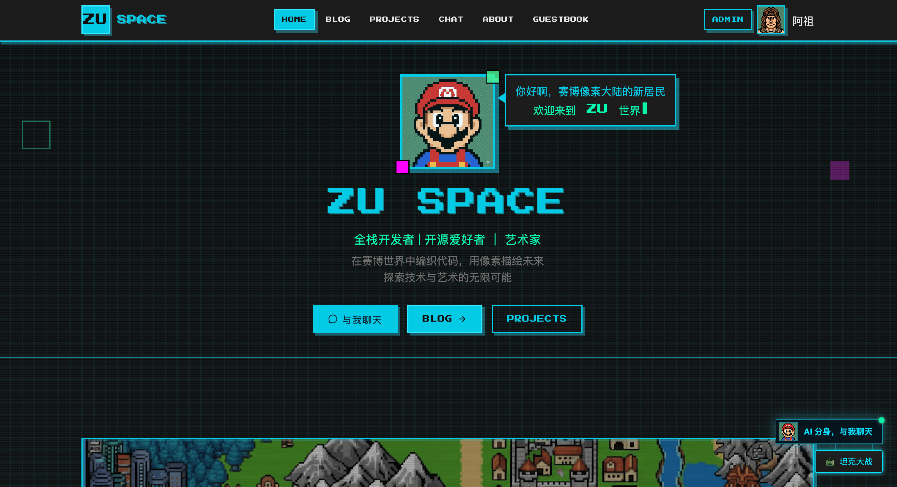
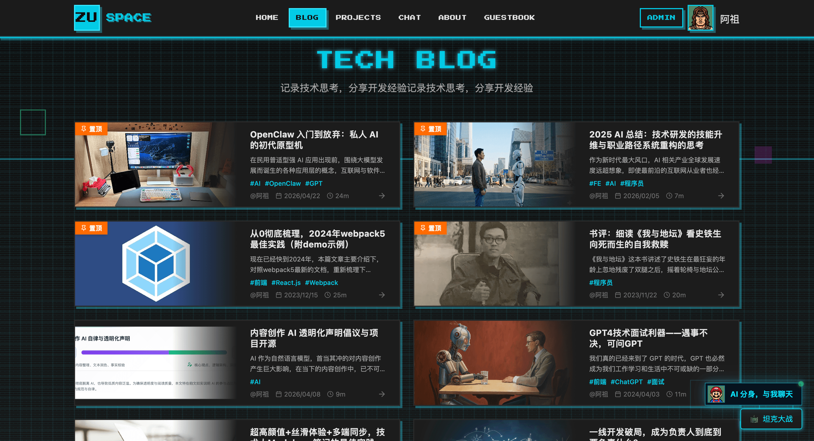
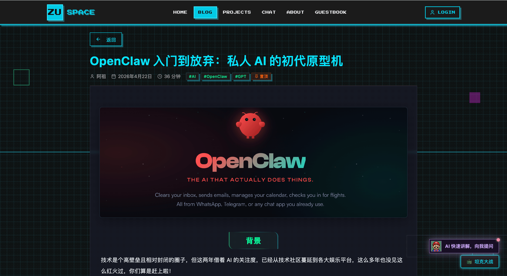
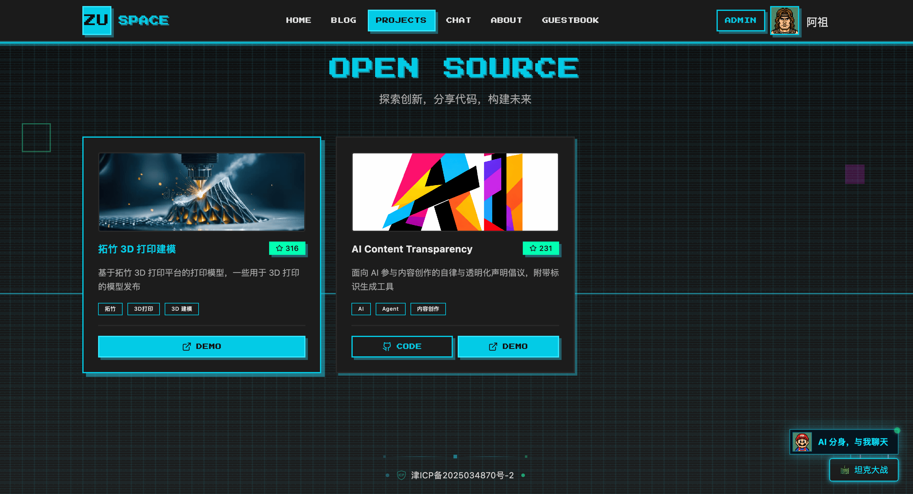
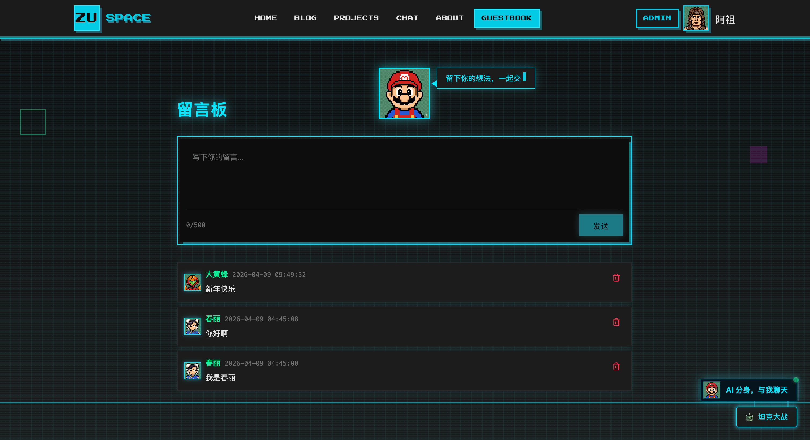
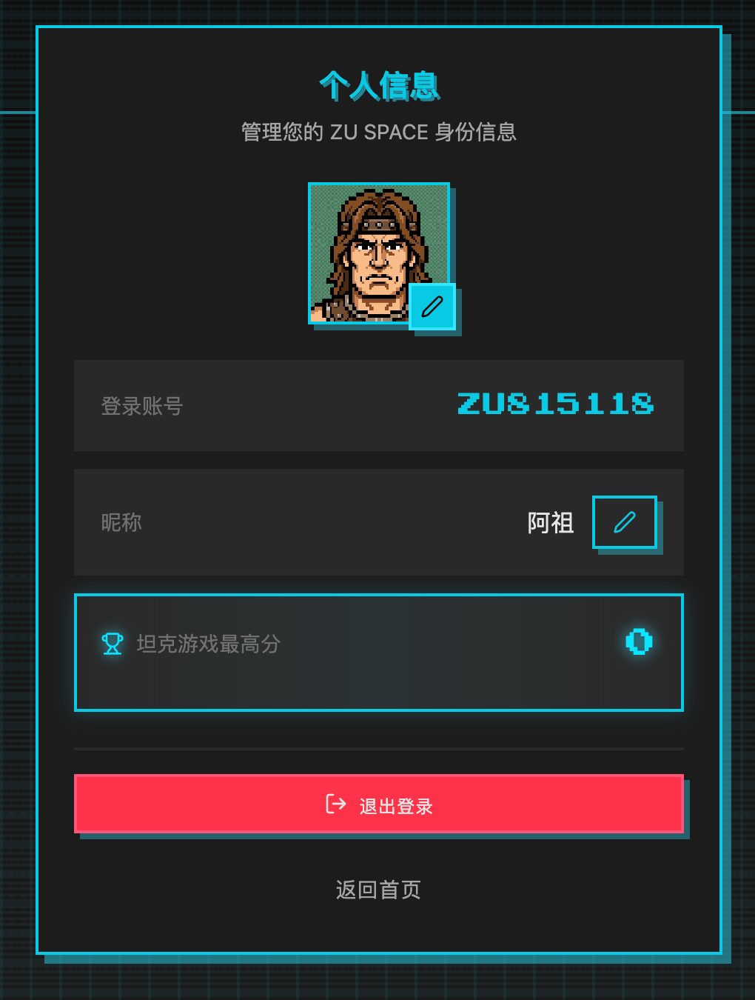
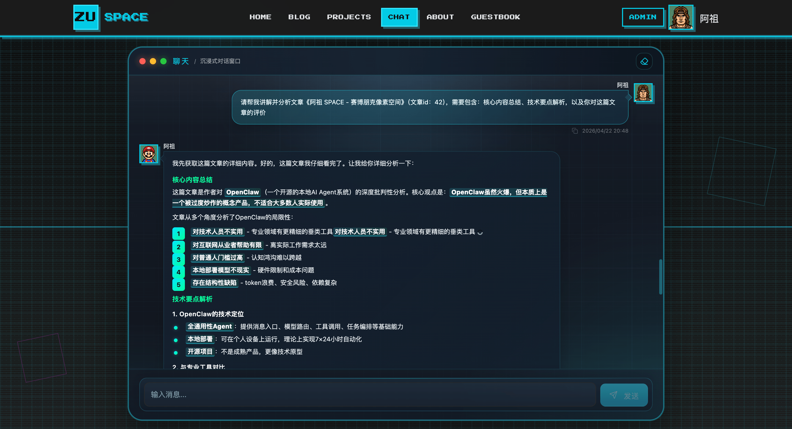
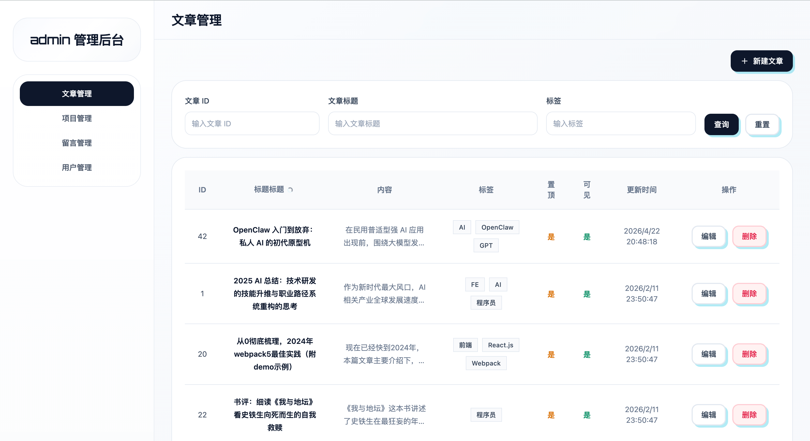
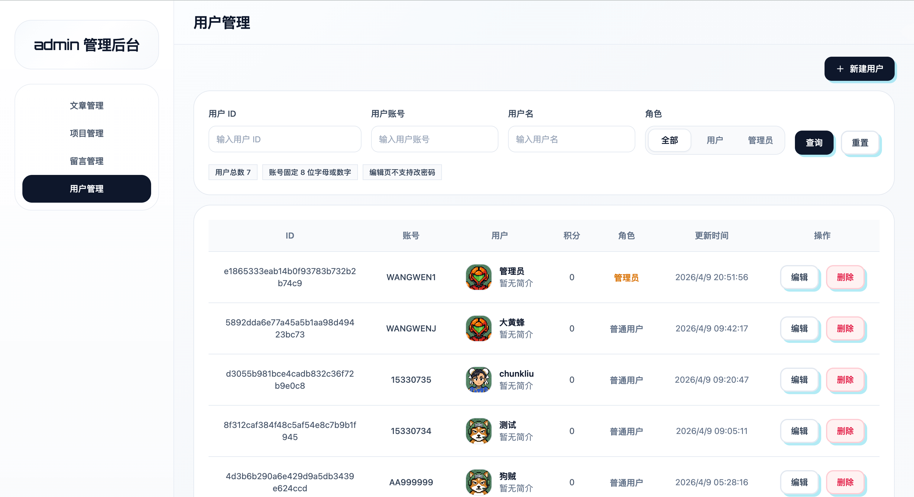

<div align="center">
  
  <h1>ZuSpaceX</h1>
  <p>赛博像素风个人主站 · 全栈开源</p>

[](https://react.dev)
[](https://nestjs.com)
[](https://www.typescriptlang.org)

**[官方文档](https://wwenj.github.io/zuSpaceX/)** · **[在线体验](https://www.wwenj.com)**

</div>

---

## 简介

ZuSpaceX 是一套围绕**内容展示 + 内容管理 + AI 问答**设计的全栈个人主站系统，赛博像素风，页面美观精致，适合作为个人品牌站点的二开基础。

## 功能

| 模块     | 说明                                                       |
| -------- | ---------------------------------------------------------- |
| 公开站点 | 首页、个人简历、博客、评论、开源项目展示、留言板、个人中心 |
| 互动     | 留言、文章评论、坦克大战积分榜，Chat 聊天                  |
| 权限     | Cookie + Session 登录态、普通用户 / 管理员角色             |
| 管理后台 | 文章、项目、留言、用户四类后台管理                         |
| AI Agent | 内置对话页，基于大模型、作者设定、文章与项目内容流式问答   |

## 技术栈

| 模块 | 技术                                        |
| ---- | ------------------------------------------- |
| 前端 | React 19 · TypeScript · Vite · Tailwind CSS |
| 后端 | NestJS · TypeORM · MySQL · Swagger          |
| AI   | LangChain · LangGraph · OpenAI 兼容接口     |
| 部署 | Docker 容器化部署                           |

## 项目结构

```
zuSpaceX/
├── client/               # React + Vite 前端
│   └── src/
│       ├── pages/        # 公开站点页面
│       ├── admin/        # 管理后台页面
│       ├── components/   # 通用组件
│       ├── api/          # 接口封装
│       └── router/       # 路由配置
├── server/               # NestJS 服务端
│   └── src/
│       ├── modules/      # 业务模块（article / project / agent …）
│       ├── entities/     # TypeORM 实体
│       └── common/       # 中间件、过滤器、日志
├── docs/                 # VitePress 文档站
├── build.sh              # 前后端联合构建
└── Dockerfile            # Docker 容器化部署
```

## 项目启动

**环境要求：**

- `Node.js ≥ 18`
- `pnpm ≥ 8`
- `MySQL 8.x`

```bash
# 服务端
cd server
pnpm install
npm run start:dev

# 前端（新终端）
cd client
pnpm install
pnpm run dev
```

| 服务    | 地址                           |
| ------- | ------------------------------ |
| 前端    | http://localhost:3000          |
| API     | http://localhost:3001          |
| Swagger | http://localhost:3001/api-docs |

## 构建与部署

### 手动构建 + 手动部署

```bash
bash build.sh
```

脚本依次构建前端、将产物并入服务端，最终产物在 `server/dist`。将 `server/dist`、`server/views`、`server/public`、`server/package.json` 上传至服务器，在服务器上执行：

```bash
npm run start:prod
```

### Docker 构建部署一体化（推荐）

`Dockerfile` 内已包含前后端完整构建逻辑，推送代码到容器部署平台后平台会自动完成构建和部署，无需本地预先构建。

```bash
docker build -t zuspace . && docker run -p 8080:8080 zuspace
```

## 数据库

- 当前项目不包含数据库，运行前请先手动建库建表，使用 `/sql` 下的建表语句。
- 建表完成后需要在项目中完成数据库账号的配置
- 具体接入配置在 `server/src/config/mysql.config.ts`，具体操作见文档

## AI Agent

- 当前项目的`作者分身`能力底层依赖大模型，当前项目内不包含模型配置，请先配置个人的模型 api-key
- 具体接入配置在`server/src/modules/agent/llm.config.ts`，具体操作见文档

## 演示预览

<div align="center">

### 首页



### 博客列表



### 博客详情



### 项目展示



### 留言板



### 个人中心



### AI 分身聊天



### 后台管理




</div>

## License

[MIT](./LICENSE)
